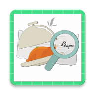

# Recipeez - Recipe Finder App

<p align="center">
  
</p>

## Overview
Recipeez is a modern recipe finder Android application that helps users discover recipes based on ingredients they have, dietary preferences, and cuisine types. Using the Spoonacular API, it provides a comprehensive recipe search and filtering system to make cooking easier and more accessible.

## Features
- **Smart Recipe Search**
  - Search by recipe name
  - Find recipes by available ingredients
  - Advanced filtering options

- **Recipe Browser**
  - Clean, grid-based recipe display
  - Detailed recipe information
  - Easy navigation and browsing

- **Filtering Options**
  - Cuisine types
  - Dietary restrictions
  - Meal types
  - Nutritional requirements

- **User-Friendly Interface**
  - Material Design implementation
  - Intuitive navigation
  - Modern and clean UI

## Technical Details
- **Platform**: Android
- **Minimum SDK**: 29
- **Target SDK**: 34
- **Development Environment**: Android Studio Jellyfish
- **Language**: Java
- **API**: Spoonacular API

## Dependencies
```gradle
dependencies {
    implementation 'com.google.android.material:material:1.11.0'
    implementation 'com.squareup.retrofit2:retrofit:2.9.0'
    implementation 'com.squareup.retrofit2:converter-gson:2.9.0'
    implementation 'com.github.bumptech.glide:glide:4.12.0'
    // Add other dependencies
}
```

# Recipeez

Recipeez is an Android application designed to help users find recipes and plan meals based on their preferences and available ingredients.

## Setup

### Clone the Repository
```bash
git clone https://github.com/1Frazel/recipeez.git
```

### Get an API Key from Spoonacular
Visit the [Spoonacular API website](https://spoonacular.com/food-api) and sign up to get your API key.

### Add Your API Key
Insert your API key in `MainActivity.java`:
```java
private static final String API_KEY = "your_api_key_here";
```

### Build and Run the Project
Open the project in Android Studio, build it, and run it on an emulator or a physical device.


## Contributing
Contributions are welcome! Please feel free to submit a Pull Request.

## Contact

M. Adib Aulia Nurkhafif - adibnk11@gmail.com

Project Link: [[GitHub Repository URL](https://github.com/1Frazel/Recipeez)]
